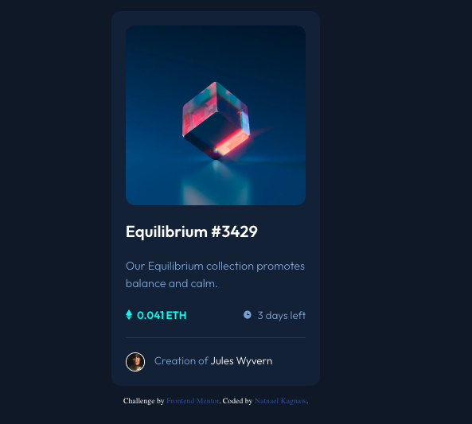

# Frontend Mentor - NFT preview card component solution

This is a solution to the [NFT preview card component challenge on Frontend Mentor](https://www.frontendmentor.io/challenges/nft-preview-card-component-SbdUL_w0U).

## Table of contents

- [Overview](#overview)
  - [The challenge](#the-challenge)
  - [Screenshot](#screenshot)
  - [Links](#links)
- [My process](#my-process)
  - [Built with](#built-with)
  - [What I learned](#what-i-learned)
  - [Continued development](#continued-development)
  - [Useful resources](#useful-resources)
- [Author](#author)
- [Acknowledgments](#acknowledgments)

## Overview

### The challenge

Users should be able to:

- View the optimal layout depending on their device's screen size
- See hover states for interactive elements

### Screenshot



### Links

- Solution URL: [Github Link](https://github.com/NatnaelSisay/nft-preview-card-component-main)
- Live Site URL: [Netlify Link](https://loquacious-syrniki-630ed1.netlify.app/)

## My process

### Built with

- Semantic HTML5 markup
- CSS custom properties
- Flexbox
- CSS Grid
- Mobile-first workflow

### What I learned

I have faced a challenge when i try to make the active state of the image.
the issue was how to trigger the image showing part when the element is hover or active.
at first i try to add ::before on the `.card__image` itself, but the selector didn't work
`.car__image:is(:hover, :focus) .card__image::before` so i stoped it. then i figured i could add the image inside the `.card__image` class and it become easier to targer the element.

```css
.card__image {
	position: relative;
	border-radius: var(--border-radious);
	overflow: hidden;
}

.card__background {
	content: "";
	background-color: hsl(var(--clr-primary-hsl-500), 0.5);

	display: none;
	place-items: center;

	position: absolute;
	top: 0;
	bottom: 0;
	left: 0;
	right: 0;
}

.card__image:hover .card__background {
	display: grid;
}

/* updated */
.card__image {
	position: relative;
	border-radius: var(--border-radious);
	overflow: hidden;
}

.card__image::after {
	content: url(../images/icon-view.svg);
	background-color: hsl(var(--clr-primary-hsl-500), 0.5);

	display: grid;
	place-items: center;
	opacity: 0;
	transition: opacity ease-in-out var(--transition-default);

	position: absolute;
	inset: 0;
}

.card__image:is(:hover, :focus)::after {
	opacity: 1;
}
```

### Continued development

I could add transition for the hover and other effects.

### Useful resources

- [CSS Scan](https://getcssscan.com/css-box-shadow-examples) - This helped me for setting up box shadow with just a click.
- [Josh Comeau](https://www.joshwcomeau.com/css/custom-css-reset/) - The perfect place for CSS Rest.
- [nft-card-component-token](https://github.com/Felix221123/nft-card-component-token/tree/main) - reviewed how other have implimented it.

## Author

- LinkedIn - [Natnael Kagnaw](https://www.linkedin.com/in/natnael-kagnaw/)
- Frontend Mentor - [@@NatnaelSisay](https://www.frontendmentor.io/profile/NatnaelSisay)

## Acknowledgments

I would like to thank Front-end mentor and the discord community.
